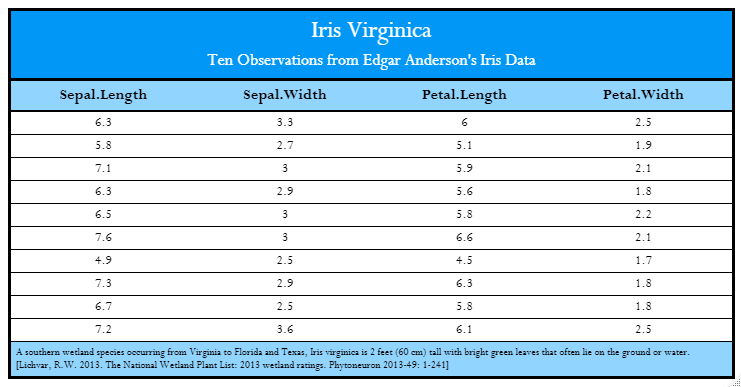
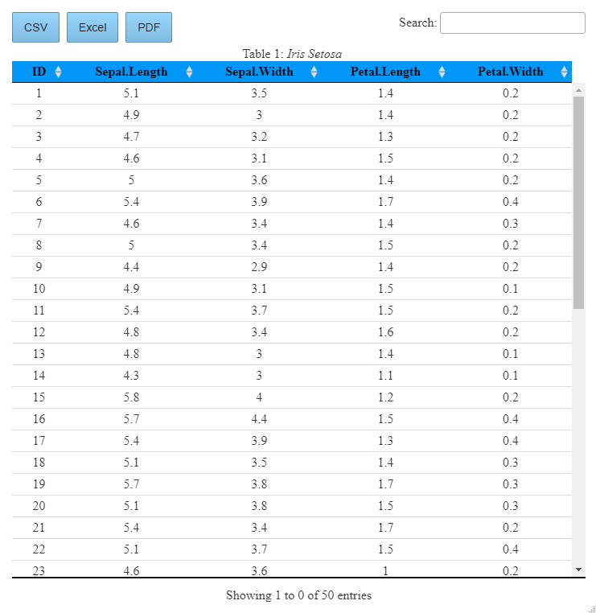
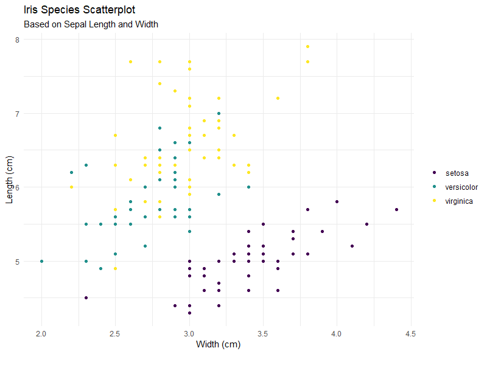

# Thematic

Package for generating tables and visuals in report or research documentation. 
This is to increase efficiency and allow for reproducibility within all projects.

This package is an extension built upon the gt, Dt, ggplot, and unikn packages.


# Examples

The following shows some of the usability of this package with the Iris data set.

## Static Table

```r

iris%>%
  filter(Species=="virginica")%>%
  select(-Species)%>%
  slice_head(n=10)%>%
   tabGT(table_title = "Iris Virginica",
         table_subtitle = "Ten Observations from Edgar Anderson's Iris Data",
         source_doc = "A southern wetland species occurring from Virginia to Florida and Texas, Iris virginica is 2 feet (60 cm) tall with bright green leaves that often lie on the ground or water. [Lichvar, R.W. 2013. The National Wetland Plant List: 2013 wetland ratings. Phytoneuron 2013-49: 1-241]")
```



This could be used as is within an html document.
For static environments it would necessary to use gt::gtsave() with a library that reads in image files or the webshot library.

## Interactive Table

```r 
iris%>%
  filter(Species=="setosa")%>%
  select(-Species)%>%
  tabDT(table_number = "Table 1:",
        table_title = "Iris Setosa")
```


<br/>

As this is interactive, this would be used within a html enviroment.

## Visual Theme and Presets

```r
iris%>%
  ggplot()+
  geom_point(aes(x=Sepal.Width,y=Sepal.Length,color=Species))+
  scale_color_manual(values = Vir(3))+
  gg_tool(title_label = "Iris Species Scatterplot",
          subtitle_label = "Based on Sepal Length and Width",
          x_label = "Width (cm)",
          y_label = "Length (cm)")
```

<br/>



The above visual is utilizing the viridis palette along with some ggplot pre-sets that I initially use when visualizing data.
